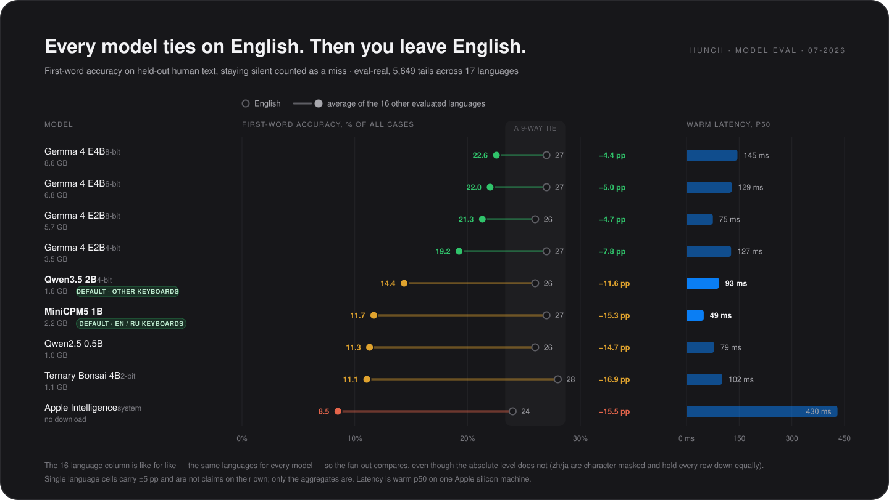
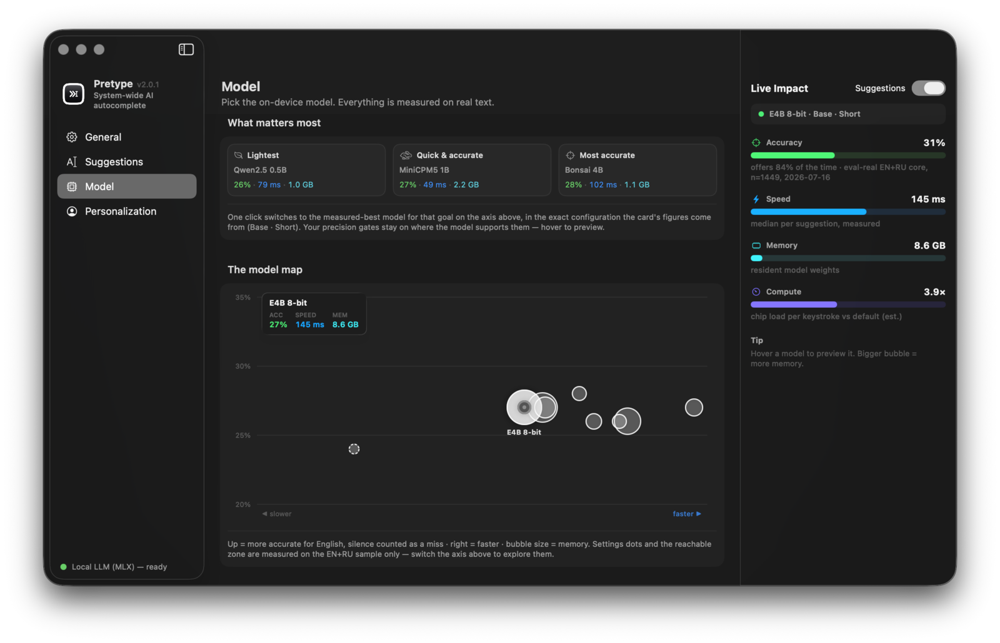

# Choosing a model

Every model in the catalog — plus the Apple Intelligence system model — is measured on the same held-out eval: first-word accuracy on real human text, where staying silent counts as a miss.

* **Typing in English?** No model measurably beats another — all nine land between 24% and 28%, inside the ±5 pp a single-language cell carries. So pick on speed and size: MiniCPM5 1B is the fastest in the catalog at 49 ms.
* **Typing in anything else?** The tie collapses. The Gemma 4 tiers give up 4–8 points; MiniCPM5, Bonsai and Qwen 0.5B give up more than half of what they scored on English. **Qwen3.5 2B** sags least of the small models and is the best sub-2 GB pick — it beats Bonsai, Qwen 0.5B and the larger MiniCPM5 (all p<0.001).
* **Typing in Russian?** Not the same question as English, which is why the two are never averaged into one figure here. Every small model is stronger in English than in Russian: MiniCPM5 ties Gemma E2B 8-bit on English (27% vs 26%, p=0.35) and gives up 6 points on Russian (17% vs 23%, p<0.001), and within the small class nothing beats it there (Qwen3.5 2B ties it, p=0.79). That asymmetry is why the memory ladder below hands Russian typists a Gemma tier as soon as the Mac affords one — even the lightest, E2B 4-bit, beats every small model on Russian outright (direct McNemar p<0.01) — while on English the tiers are a tie and the ladder buys chords, not completions.
* **Tight on RAM?** Qwen2.5 0.5B runs in ≈1 GB and stays with the pack on English.
* **Arabic or Hebrew?** Measured separately (560 held-out rows, 2026-07-25) and it is the hardest ground in the catalog. Every small model lands at 4–10% and they are statistically tied with each other, so within the sub-2 GB class no pick helps; a Gemma tier roughly doubles it (E2B 8-bit: 11% Arabic, 18% Hebrew) and is worth the RAM if you have it. Two traps: MiniCPM5 is effectively blind in Hebrew (1%), and Apple Intelligence answers *more* often than any downloadable model (86% of the time) while being right on 4–6%. Inline typo fixes are inert in both languages — macOS lists them as spell-check languages but ships no dictionary.
* **Tempted by Apple Intelligence?** It's the only option with no download and no app memory (macOS 26+) — but it's last on both axes here: 430 ms against 49–145 ms, and the steepest multilingual drop in the chart. Polish, Romanian and Czech are outside its supported set entirely.

The default used to be chosen from your keyboard layouts; since 2026-07-25 it is **sized to your Mac** instead — the strongest tier whose resident model stays within about a quarter of physical memory:

| Mac memory | Default | Resident (recommended config) |
|---|---|--:|
| 8 GB | Qwen3.5 2B | ≈1.6 GB |
| 16–18 GB | Gemma E2B 4-bit | ≈3.5 GB |
| 24 GB | Gemma E2B 8-bit | ≈5.0 GB |
| 32 GB and up | Gemma E4B 6-bit | ≈6.8 GB |

Language dropped out of the rule because no per-language gap between the small models survives the significance bar (MiniCPM5's English lead over Qwen3.5 is a trend at p=0.014, Russian a tie at p=0.79, Japanese p=0.064), while the chord measurements split hard against the old English/Russian default: MiniCPM5's fix is inert at 4%. It remains the manual pick for the lowest latency (49 ms) and the best reply drafts (56%); E4B 8-bit remains the manual best-quality pick (it ties 6-bit at p=0.052 for 1.8 GB more). Your keyboard languages still drive the persona and the per-language menu nudge, and everything else is one click in **Settings → Model**, where each entry ships its own eval-backed recommended settings and the catalog re-ranks for any of the 19 evaluated languages.

<i>The same data live in the app — a speed × accuracy map with one-click presets and a per-language accuracy axis.</i>

Chart method: equal-weight mean over `cs de es fr it ja ko nl pl pt ro ru sv tr uk zh`, matched register cells only (Arabic and Hebrew were measured later, on their own set, and are not in this chart). Absolute values are not comparable *between* languages (zh/ja are character-masked), so the mean measures spread across languages, not skill at any one of them. Every language cell is 280 held-out rows — English 560, Russian 689 — which is ±5 pp near 20% and ±3 pp at Russian's size; a gap smaller than that is not a result. The app shows the same tolerance and sample size beside each figure, and lets you pick any single language as the axis rather than reading an average.

## Fixing and replying

The two chords — fix the selection (<kbd>⌥Tab</kbd>) and draft a reply from the screen (<kbd>⌥⇧Tab</kbd>) — don't run on the model you picked: they run on its **instruct sibling**, so the numbers that matter are the sibling's. Measured 2026-07-25 on their own held-out sets: 510 single-typo sentences plus 170 clean controls across 17 languages for the fix (through the full app pipeline, gates included), 570 on-screen conversations across 19 languages for the reply.

| Runs the chords | Loaded by (recommended settings) | Exact fix | Touches clean text | Fix p50 | Usable replies | Reply p50 |
|---|---|--:|--:|--:|--:|--:|
| Gemma E4B-it 4-bit | Gemma E2B 8-bit; floor for both E4B tiers¹ | **65%** [60–69] | 21% | 1.5 s | 33% [30–37] | 0.5 s |
| Gemma E2B-it 4-bit | Gemma E2B 4-bit | 50% [45–54] | 29% | 0.4 s | 32% [28–36] | 0.4 s |
| Qwen3.5 2B (itself) | Qwen3.5 2B — the 8 GB default | 32% [28–37] | 28% | 0.3 s | 46% [42–50] | 0.4 s |
| Bonsai 4B (itself) | Ternary Bonsai 4B | 21% [18–25] | 14% | 0.3 s | 21% [18–25] | 0.3 s |
| Qwen2.5 0.5B-it | Qwen2.5 0.5B | 11% [9–14] | 19% | 0.2 s | 38% [35–42] | 0.3 s |
| MiniCPM5 1B-it | MiniCPM5 1B | 4% [2–6] | 14% | 0.7 s | **56%** [52–61] | 1.8 s |

Three things worth knowing before reading it as a ranking:

* **The two tasks have opposite winners.** The Gemma E4B sibling is the strongest fixer in the catalog (vs E2B-it p=10⁻¹⁰, paired over the same 510 rows) and a mediocre replier outside English (97% usable in English, 20–33% elsewhere). MiniCPM5's instruct build is the strongest replier (vs Qwen3.5 p=5×10⁻⁴) — strongest exactly where its completions are weakest (Korean 90%, Arabic 87%, Russian 83%, Japanese 80%, but Swedish 10%) — and as a fixer it is effectively inert at 4%. No single sibling wins both chords. The fix column is a clean ladder — every adjacent gap is significant at p<0.01, with Bonsai slotting between Qwen3.5 and Qwen 0.5B — while on replies Bonsai comes last outright: its drafts survive in English (80%) and Russian (70%) and collapse elsewhere.
* **"Exact fix" is a strict bar and "usable reply" is a lenient one.** A correct fix phrased differently than the original counts as a miss, so real-world usefulness sits above the fix column. A usable reply only means it drafted *something*, in the conversation's language, without parroting the screen — it says nothing about how good the reply reads, and reference-similarity scores were too noisy to book.
* **"Touches clean text" is the cost of the chord.** Select an already-correct line and the sibling still proposes a change that often — 14–29% across the catalog. The app's minimal-edit gate is already inside these numbers; <kbd>Esc</kbd> keeps your original.

¹ The E4B 8-bit and 6-bit tiers run the *6-bit* instruct sibling, which the sweep didn't cover — the 4-bit row is its measured floor. Method: totals over 510/570 rows carry ±4 pp; per-language cells are 30 rows (±17 pp) and are only used here for direction, never for claims. Fix numbers are from the 2026-07-25 rerun after the run-on trim and turn-marker stop landed — the first pass lost 39% of the E4B sibling's rows to same-line junk, which is what the rerun recovered. Sets: `eval-correct` (one real typo per sentence, Tatoeba register), `eval-reply` (screen-shaped conversations, right-language/no-echo contract).

## What a model costs you

Disk and memory track each other: the default holds **≈1.6–6.8 GB** resident — sized to about a quarter of the Mac's memory, per the ladder above — the catalog goes down to ≈1 GB, and Gemma 4 E4B 8-bit tops it at ≈8.6 GB. Warm completions run **49–145 ms** across the local models, against 430 ms for Apple Intelligence, which downloads nothing and holds no app memory at all.

That resident figure is what a model holds *while you type*, not all day: it unloads itself after five idle minutes and reloads on your next keystroke, and unloads early if macOS reports memory pressure. Using <kbd>⌥Tab</kbd> rewrites can add a one-time instruct sibling on some models — ≈2.2 GB on MiniCPM5, up to ≈5 GB on a Gemma running Base style; none on Qwen3.5 or Bonsai, which correct with themselves, and none on a Gemma tier in its recommended Instruct style, where the loaded model already is the instruct build.

Quantization tiers, the engine split and the confidence gate are in [Architecture](ARCHITECTURE.md). Training a model on your own writing is in [Fine-tuning](finetuning.md).
